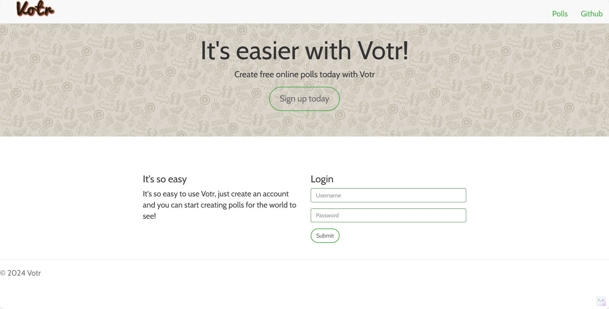
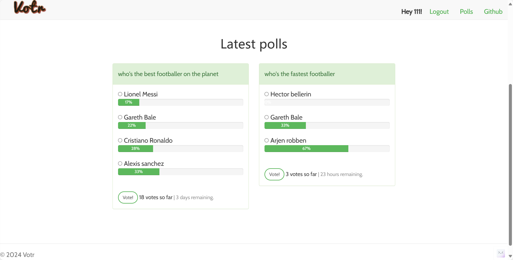
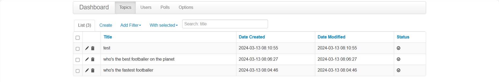
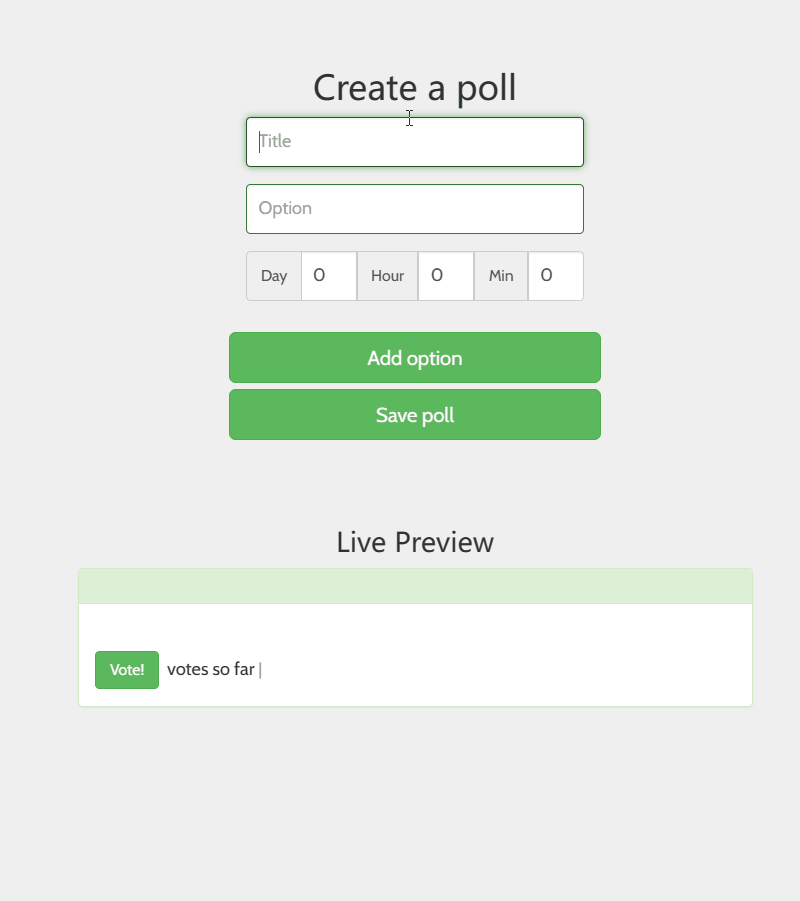
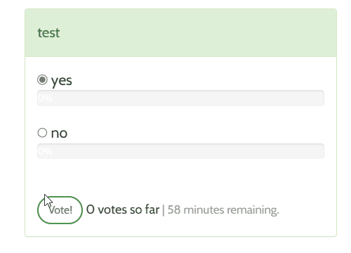

>这个项目不是我自创的项目，该项目源于一个Flask的教程，这是教程的[链接](https://danidee10.github.io/2016/09/18/flask-by-example-1.html)，这是原教程的[GitHub仓库](https://github.com/danidee10/Votr)

### 下面的截图是我的完成情况

#### 登录页

#### 注册页面

#### 主页

#### 管理页面

#### 添加投票页面

#### 投票

